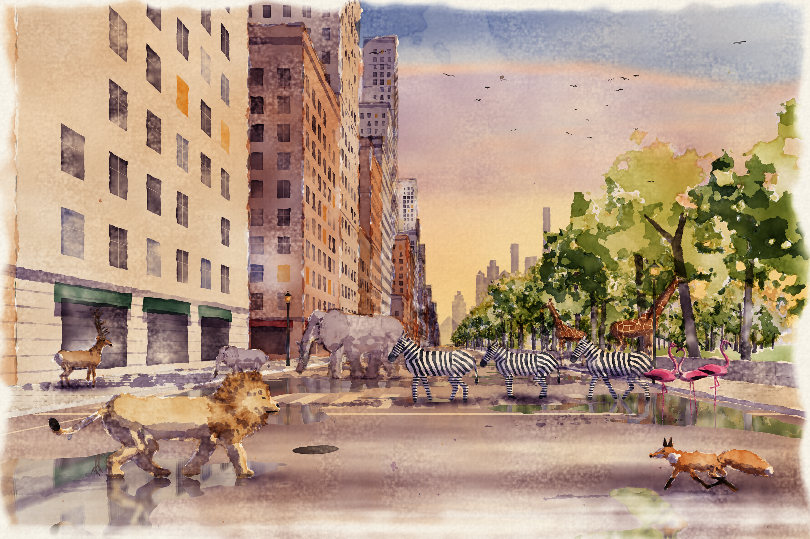

# Wild Hours — a per-pixel watercolour



A city avenue at golden hour after rain, with elephants, zebras, giraffes, a
lion, a stag, a fox, flamingos and a flock of birds roaming through it.

Every pixel is computed with plain numpy maths, and **numpy is the only
dependency**. There is no drawing or image library, no brush engine and no
image asset. The distance transforms, bounding boxes and the PNG encoder are
all written here with numpy. The encoder uses only the Python standard
library's `zlib` to deflate the finished bytes.

## Run it

```bash
pip install numpy
python render.py                              # 2400x1600 -> wild_hours.png (~1 min on 4 cores)
python render.py --width 900 --out preview.png
```

The render is deterministic. The same code always produces the same image.

## How it works

**Paper** (`wc_core.py`). The cold-press tooth is fBm value noise mixed with
inverted Voronoi domes and stretched fibre noise. It also has large-scale
cockling and a pixel-scale clumping field. Everything painted afterwards
interacts with this paper.

**Pigment model** (`wc_core.py`). Each pigment is its colour at density 1 on
white, turned into Beer–Lambert absorption, plus a granulation strength.
Pigments mix subtractively, by adding their absorptions. A wash multiplies
the canvas by `exp(-density * absorption)`, so glazes build up like real
transparent watercolour. `Painter.wash` turns a signed distance field into
one wash with:

- noise-displaced edges, so neighbouring washes overlap or leave paper gaps
- pigment migrating to the drying edge ("coffee ring" edge darkening)
- uneven flow inside the wash
- granulation that settles into the paper valleys
- cauliflower blooms
- dry-brush break-up on the peaks of the tooth

**Geometry** (`wc_city.py`). A pinhole camera casts a ray per pixel against:

- axis-aligned boxes (buildings, pavements, the park wall)
- the ground plane
- flat "sprites" standing in planes of constant depth (trees, lamps, animals),
  each described by an SDF in world metres

The result is a G-buffer of object, face, world hit point and depth. Region
edges come from Euclidean distance transforms of that buffer, so every wash
knows how far each pixel is from its boundary. The transform is written in
numpy (`wc_core.edt`) and is separable:

- down each column, running maxima and minima of seed indices give the 1-D
  distance
- along each row, `min_d G(j+d) + d²` is a chain of 3-tap min-plus erosions
  with costs 1, 3, 5, …, whose partial sums are the squares

It is exact out to 3% of the image height, which is further than any
watercolour effect looks.

**Light**. The sun sits low on the right. Shadows are projected per pixel:

- each receiving surface point is pushed along the sun direction into every
  sprite's plane, and that sprite's SDF is evaluated there
- facades get sunlit gold, faces turned away get cool violet glazes
- distance adds atmospheric haze

**Animals** (`wc_fauna.py`). Each animal is a union of tapered capsules,
ellipses and Bézier tubes in local metres. Form shading comes from inflating
the SDF into a pseudo-3-D normal with a sphere profile. The patterns are also
computed per pixel:

- giraffe patches from an exact Voronoi border distance
- zebra stripes from a blend of noise-warped cosine phase fields: vertical on
  the barrel, arcs over the rump, rings round the legs
- the lion's mane from strands in polar coordinates

**Trees** (`wc_flora.py`). Crowns are smooth unions of blobs roughened by fBm.
Sky holes are carved into the SDF itself, so the ray caster really sees
through the foliage.

**Finish**. The last pass adds:

- puddle reflections: each pixel's ray is mirrored in the wet road and traced,
  and the colour is fetched from the painted canvas where that point is seen
  directly, then smeared vertically like wet strokes
- a graphite under-drawing found from G-buffer edges, with overshooting
  construction lines
- flicked splatter
- an irregular painted border that fades the foreground into paper
- raking light over the paper tooth

## Files

| file | contents |
| --- | --- |
| `render.py` | entry point / pipeline |
| `wc_core.py` | noise, SDF primitives, distance transform, PNG encoder, pigments, paper and the wash model |
| `wc_city.py` | camera, ray casting, shadows, sky, skyline, buildings, street, reflections, finishing |
| `wc_flora.py` | park trees and street lamps |
| `wc_fauna.py` | the animals and the birds |
