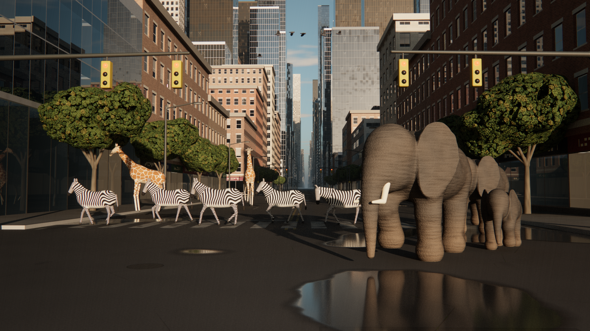

# Rewilded Avenue: a per-pixel path-traced cityscape with wild animals



A city avenue at golden hour. An elephant family walks towards the camera, a herd of zebras
uses the zebra crossing (the lights are red for traffic), one giraffe browses a street tree
and another ambles down the road. Pigeons wheel overhead.

The image is produced by `render.c`, a single-file C program with no dependencies beyond
libm, zlib and OpenMP. There is **no 3D engine, no mesh and no image texture**. Every
pixel's colour is computed from maths: a ray is cast through the pixel, intersected
analytically or by sphere tracing, and shaded by a Monte-Carlo estimate of the rendering
equation.

## Build and run

```sh
make                      # gcc -O3 -march=native -ffast-math -fopenmp render.c -lm -lz
./render -w 1920 -h 1080 -spp 256 -o cityscape_wildlife.png    # ~50 min on 4 cores
./render -w 640 -h 360 -spp 16 -o preview.png                  # ~20 s preview
```

| option | meaning |
|---|---|
| `-w`, `-h`, `-spp` | resolution and samples per pixel |
| `-depth N` | maximum path length (default 4) |
| `-exp E` | exposure multiplier before the tone curve (default 0.9) |
| `-sun AZ EL` | sun azimuth (degrees from behind the camera towards the right) and elevation |
| `-cam ex ey ez tx ty tz fov` | eye, target and vertical field of view |
| `-lens R F` | thin-lens aperture radius and focus distance (metres) |
| `-scene 1` | animal "turntable" test scene with no city |
| `-raw file` / `-develop file` | save the linear HDR frame / re-grade a saved frame without re-rendering |
| `-seed N` | use a different block of samples (so several runs can be averaged) |

## What happens for every pixel

1. **Camera ray.** A sub-pixel position is drawn from a tent filter and the pixel is mapped
   onto the image plane: `d = normalize(f + x·tan(fov/2)·aspect·r + y·tan(fov/2)·u)`.
   A point on the lens aperture is sampled for depth of field (thin-lens model, focus 14 m).

2. **Intersection.**
   - Ground plane: `t = -o.y / d.y`.
   - About 1,300 axis-aligned boxes (buildings, setbacks, cornices, pavements) are tested
     with the slab test inside a bounding volume hierarchy.
   - Animals, trees, street lights, traffic signals and birds are **signed distance fields**.
     A ray is sphere-traced inside each object's bounding box: `t ← t + f(o + t·d)` until
     `f < ε(t)`. Normals are the SDF gradient, taken by central differences on a tetrahedron.

3. **Animals as maths.** Each animal is a smooth union (`smin`) of ellipsoids, round cones
   and capsules. The legs are posed by a walking gait: every foot follows a stance/swing
   trajectory, and the knee comes from two-bone inverse kinematics (law of cosines).
   - Elephant ears are extruded 2-D outlines with a slight cup.
   - Trunks are cubic Bézier curves swept by tapering cones.
   - Zebra stripes are `sin()` bands in body-local coordinates that rotate across the rump.
   - Giraffe patches are cells of 3-D Voronoi noise (`F2 − F1` gives the cream borders).
   - Elephant skin is bump-mapped with anisotropic creases and a cracked-skin network.

4. **Materials.** The BRDF is Lambert diffuse plus GGX microfacet specular:
   `f = (1−F)·ρ/π + D·G·F / (4·(n·l)(n·v))` with Schlick's Fresnel term, sampled with
   visible-normal (VNDF) importance sampling.
   - **Façades:** brick coursing, stone blocks, concrete panels, ribbon windows and
     curtain walls are generated per bay and floor.
   - **Windows:** each window is a recessed opening. Parallax moves the pane back into the
     wall, the ray can hit the reveals instead, and sun shadows inside the recess are
     computed analytically.
   - **Glass:** every pane is a Fresnel mirror (curtain-wall panels are slightly warped per
     panel, as real ones are). Behind it, *interior mapping* intersects the ray with a
     virtual room (ceiling, floor, side and back walls) that may be lit, dim, or hidden
     by blinds.
   - **Road:** asphalt tone, tyre-polished wheel tracks, repair patches, cracks (edges of
     Voronoi cells), oil drips, worn lane paint, crosswalks, manholes and a mossy gutter
     are all procedural. So is the mirror-like puddle that reflects the elephants.

5. **Sky and sun.** The sky radiance is the single-scattering integral of Rayleigh and Mie
   scattering through a spherical atmosphere (Nishita). It is evaluated once per direction
   into a lat-long map with a scattering integral along each view ray and optical-depth
   integrals towards the sun:
   `L(v) = E₀ ∫ [β_R(h)·P_R(θ) + β_M(h)·P_M(θ)] · e^{−τ(camera→x) − τ(x→sun)} dx`.
   - The sun's colour at street level is the transmittance `e^{−τ}` along the sun path,
     which is why the light is golden at 11° elevation.
   - A thin altocumulus deck, made of domain-warped fBm, is lit by that same sun.

6. **Urban haze.** Exponential height fog `σ(y) = σ₀·e^{−y/H}` has a closed-form optical
   depth along any ray, which gives aerial perspective: transmittance `T = e^{−τ}`, plus
   in-scattered sky and bounce light. Single-scattered sunlight is estimated with one
   shadow ray from a point drawn in proportion to `σ·T` along each camera segment.

7. **Light transport.** Paths are traced with next-event estimation of the sun (the solar
   disk is sampled as a 0.35° cone for soft shadows) and BRDF sampling for everything
   else, and are terminated by Russian roulette.
   - Glossy lobes are widened after the first diffuse bounce (path regularisation). This
     turns the puddle's caustic onto the elephants into a soft glow instead of fireflies.

8. **Film.** 256 samples per pixel are averaged, then the frame is "developed" the way a
   camera would render it:
   - veiling-glare bloom and lateral chromatic aberration;
   - natural cos⁴ vignetting and the ACES filmic tone curve;
   - sRGB encoding, luminance-dependent grain and dithering;
   - PNG output written directly with zlib.
